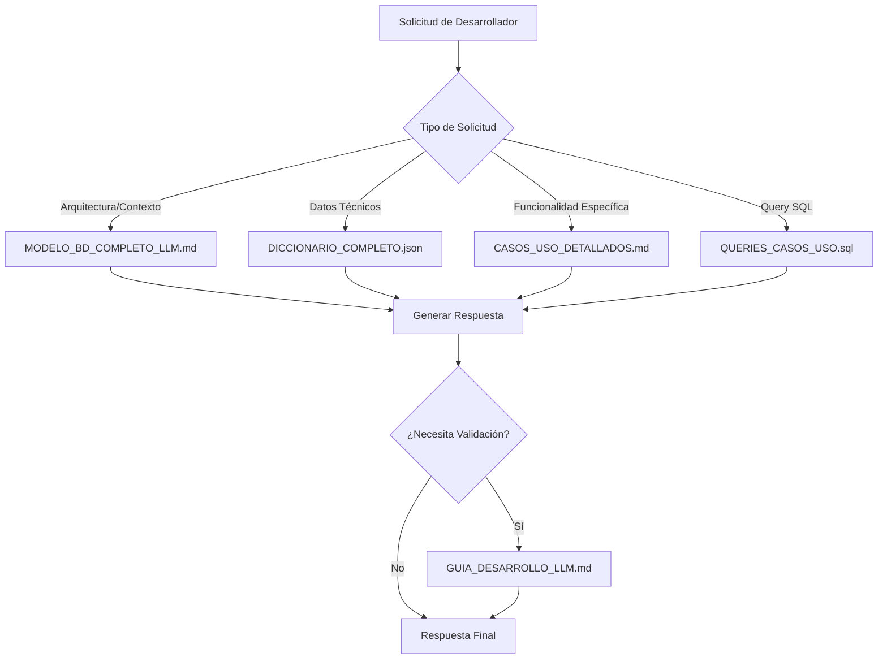

# 📚 DOCUMENTACIÓN LLM - IntelliCore POS

## 🎯 PROPÓSITO

Esta documentación está **específicamente optimizada para LLMs** para permitir desarrollo iterativo inteligente del sistema IntelliCore POS. Cada archivo está diseñado para proporcionar contexto completo y generar código funcional sin necesidad de información adicional.

---

## 📂 ESTRUCTURA DE ARCHIVOS

### 🏗 **ARQUITECTURA Y CONTEXTO**

#### [`MODELO_BD_COMPLETO_LLM.md`](./MODELO_BD_COMPLETO_LLM.md)
**🎯 Cuándo usar**: Primera consulta para entender el dominio completo
- **Contenido**: Arquitectura de 5 capas, casos de uso principales, diferenciadores
- **Para LLMs**: Contexto completo del negocio y arquitectura técnica
- **Ejemplo uso**: *"Explica la arquitectura de IntelliCore POS"*

#### [`DICCIONARIO_COMPLETO.json`](./DICCIONARIO_COMPLETO.json)
**🎯 Cuándo usar**: Necesitas nombres exactos de tablas, campos, tipos de datos
- **Contenido**: Metadatos estructurados de todas las entidades
- **Para LLMs**: Referencia técnica precisa para generación de código
- **Ejemplo uso**: *"Crear endpoint que use las tablas exactas del sistema"*

---

### 💼 **CASOS DE USO Y BUSINESS LOGIC**

#### [`CASOS_USO_DETALLADOS.md`](./CASOS_USO_DETALLADOS.md)
**🎯 Cuándo usar**: Implementar funcionalidades específicas del negocio
- **Contenido**: 10 casos de uso completos con flujos step-by-step
- **Para LLMs**: Lógica de negocio y requirements funcionales
- **Ejemplo uso**: *"Implementar el flujo de split billing para grupos"*

---

### 🔧 **CÓDIGO Y QUERIES**

#### [`QUERIES_CASOS_USO.sql`](./QUERIES_CASOS_USO.sql)
**🎯 Cuándo usar**: Necesitas queries SQL específicos y optimizados
- **Contenido**: 50+ queries organizados por módulo funcional
- **Para LLMs**: Biblioteca copy-paste ready para desarrollo rápido
- **Ejemplo uso**: *"Usar el query de dashboard tiempo real"*

---

### 🤖 **GUÍAS PARA LLMs**

#### [`GUIA_DESARROLLO_LLM.md`](./GUIA_DESARROLLO_LLM.md)
**🎯 Cuándo usar**: Protocolo para LLMs sobre cómo usar esta documentación
- **Contenido**: Metodología, patrones, ejemplos de uso efectivo
- **Para LLMs**: Instrucciones sobre cómo procesar solicitudes de desarrollo
- **Ejemplo uso**: *Consulta obligatoria para entender cómo usar el resto de archivos*

---

## 🚀 QUICK START PARA LLMs

### Protocolo de Consulta Recomendado



---

## 📋 CASOS DE USO FRECUENTES

### 🔥 **Desarrollo Backend**

#### "Crear endpoint para métricas de dashboard"
1. **Consultar**: `CASOS_USO_DETALLADOS.md` → CU-005: Dashboard Ejecutivo
2. **Usar**: `QUERIES_CASOS_USO.sql` → Query ANA-001
3. **Aplicar**: Patrón de endpoint FastAPI de `GUIA_DESARROLLO_LLM.md`

#### "Implementar split billing"
1. **Entender**: `MODELO_BD_COMPLETO_LLM.md` → Diferenciadores clave
2. **Flujo**: `CASOS_USO_DETALLADOS.md` → CU-002 y CU-004
3. **Código**: `QUERIES_CASOS_USO.sql` → Queries FACT-001, FACT-002

#### "Sistema de alertas de inventario"
1. **Contexto**: `CASOS_USO_DETALLADOS.md` → CU-008: Reabastecimiento Predictivo
2. **Query**: `QUERIES_CASOS_USO.sql` → INV-003: Alertas de stock bajo
3. **Implementar**: Siguiendo patrones de `GUIA_DESARROLLO_LLM.md`

---

### 🎨 **Desarrollo Frontend**

#### "Componente de sesión QR"
1. **Flujo UX**: `CASOS_USO_DETALLADOS.md` → CU-001: Cliente Escanea QR
2. **APIs**: `QUERIES_CASOS_USO.sql` → Queries QR-001 a QR-004
3. **Estructura**: `DICCIONARIO_COMPLETO.json` → Tabla qr_sessions_analytics

#### "Dashboard de analytics"
1. **KPIs**: `CASOS_USO_DETALLADOS.md` → CU-005 y CU-006
2. **Datos**: `QUERIES_CASOS_USO.sql` → Queries ANA-001 a ANA-004
3. **Métricas**: `MODELO_BD_COMPLETO_LLM.md` → Sección Analytics

---

### 🗄 **Desarrollo Database**

#### "Optimizar queries de reportes"
1. **Queries base**: `QUERIES_CASOS_USO.sql` → Sección reportes ejecutivos
2. **Índices**: `GUIA_DESARROLLO_LLM.md` → Sección optimizaciones
3. **Estructura**: `DICCIONARIO_COMPLETO.json` → Relaciones entre tablas

#### "Crear nuevas métricas ML"
1. **Casos uso**: `CASOS_USO_DETALLADOS.md` → CU-006: Predicción de Demanda
2. **Patterns**: `QUERIES_CASOS_USO.sql` → Query ANA-004
3. **Features**: `DICCIONARIO_COMPLETO.json` → ml_features por tabla

---

## 🎯 OBJETIVOS DE EFECTIVIDAD

### Para el LLM:
- **Tiempo de contexto**: < 30 segundos para entender cualquier solicitud
- **Precisión técnica**: 95%+ uso correcto de nomenclatura y patrones
- **Completitud**: Respuestas que no requieren información adicional

### Para el Desarrollador:
- **Velocidad desarrollo**: 60-80% reducción en tiempo de implementación
- **Consistencia**: 100% alineación con arquitectura documentada
- **Calidad**: Código funcional desde la primera iteración

---

## 📊 MÉTRICAS DE USO DOCUMENTACIÓN

### Indicadores de Efectividad LLM:
- **Reutilización Queries**: % de queries de biblioteca utilizados
- **Consistencia Nomenclatura**: % uso correcto de nombres de BD
- **Alineación Casos Uso**: % implementaciones que siguen flujos documentados
- **Tiempo Primera Implementación**: Minutos desde solicitud hasta código funcional

---

## ⚡ TIPS PARA MÁXIMA EFECTIVIDAD

### Para Desarrolladores:

```markdown
✅ **ESPECÍFICO**: "Implementar CU-002 split billing con endpoint FastAPI"
❌ **VAGO**: "Necesito hacer facturación"

✅ **REFERENCIAR**: "Usar query ANA-001 para dashboard tiempo real"
❌ **GENÉRICO**: "Mostrar métricas del restaurante"

✅ **CONTEXTO**: "Siguiendo arquitectura de 5 capas de IntelliCore POS"
❌ **SIN CONTEXTO**: "Crear sistema POS general"
```

### Para LLMs:

```markdown
✅ **CONSULTAR SIEMPRE**: Leer documentación antes de responder
✅ **REFERENCIAR**: Mencionar qué archivos y secciones usaste
✅ **EXPLICAR**: Por qué esa implementación específica
✅ **VALIDAR**: Contra casos de uso documentados
```

---

## 🔄 ITERACIONES Y MEJORAS

Esta documentación LLM evoluciona con el proyecto:

1. **Feedback Loops**: Incorporar patrones de solicitudes frecuentes
2. **Nuevos Casos Uso**: Documentar funcionalidades emergentes
3. **Optimizaciones**: Refinar queries basado en performance real
4. **Patterns**: Documentar patrones de código que funcionan bien

---

## 📞 SOPORTE Y CONTRIBUCIONES

Para mejoras a esta documentación LLM:

1. **Issues**: Reportar casos donde LLM no puede generar código funcional
2. **PRs**: Añadir nuevos casos de uso o queries optimizados
3. **Feedback**: Métricas de efectividad y tiempo de desarrollo

---

*🤖 Esta documentación transforma el desarrollo de IntelliCore POS en un proceso de colaboración inteligente entre humanos y LLMs.*
